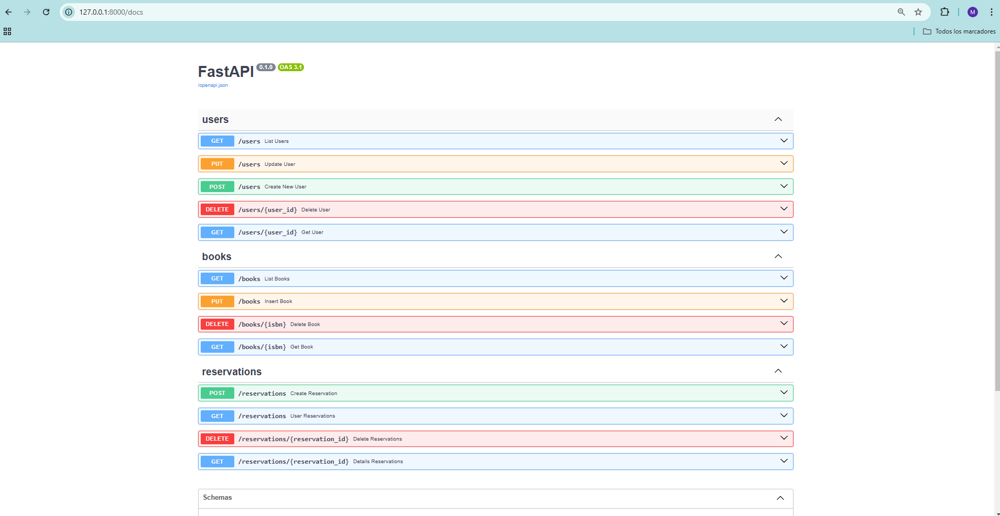

# Biblioteca "Final del Juego"
Este proyecto es un sistema de gestión de biblioteca diseñado para:
* Administrar un catálogo de libros.
* Registrar usuarios de la biblioteca.
* Gestionar reservas de libros.
* Consultar disponibilidad de los libros en tiempo real.

El objetivo principal es aprender y aplicar conceptos de desarrollo full-stack, incluyendo backend, frontend y bases de datos.

## Tecnologías Utilizadas

* Backend: FastAPI (Python)
* Base de Datos: PostgreSQL y PgAdmin para la administración .
* Frontend: React 
* Contenedores: Docker para la configuración del entorno de desarrollo

